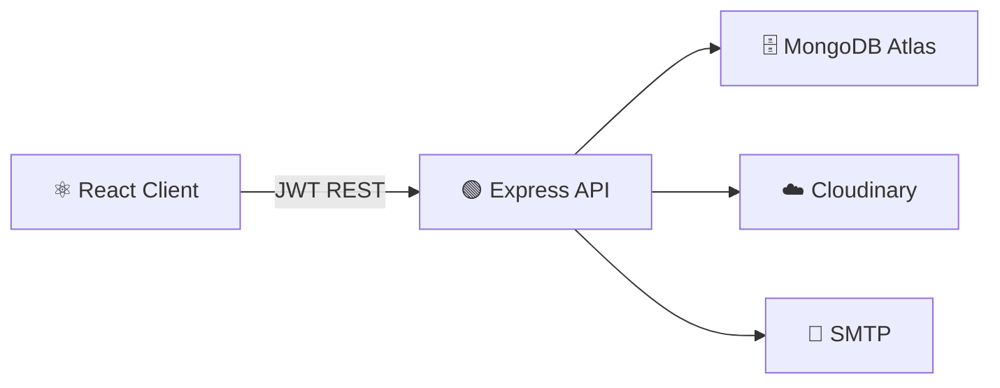
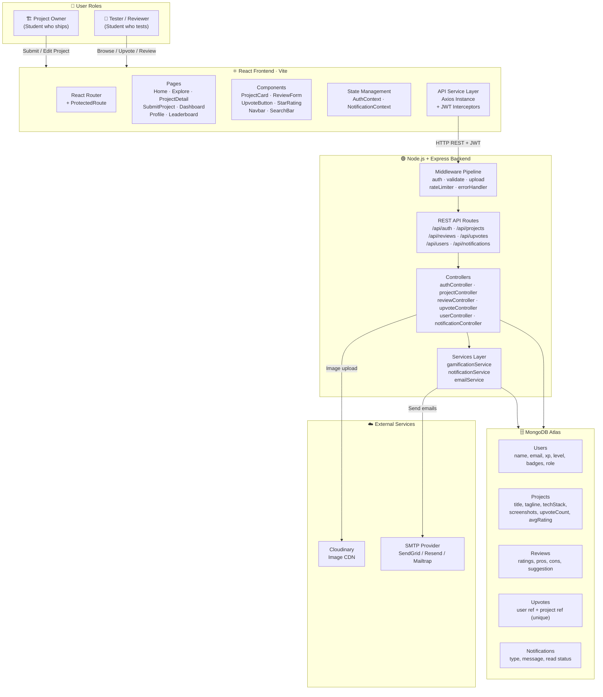
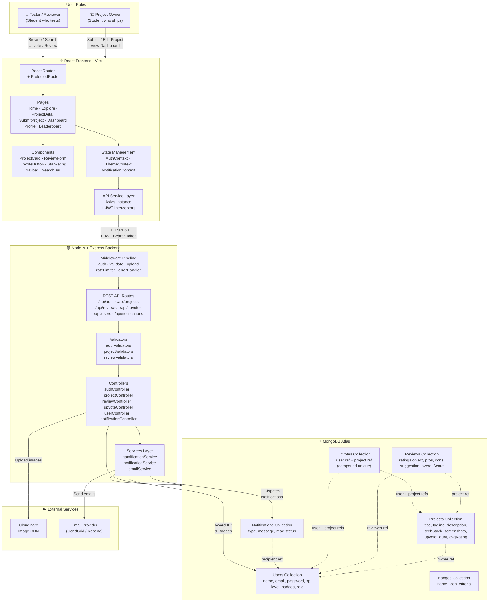
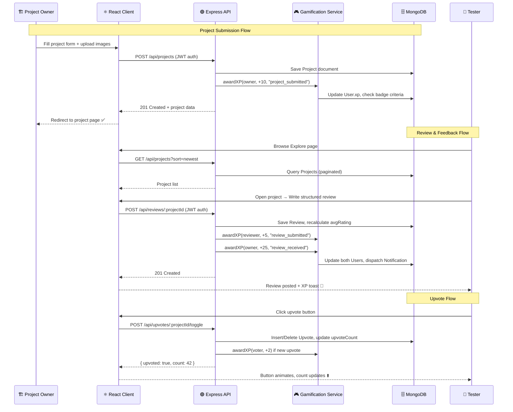

# DevHunt SRM

> **Product Hunt for Campus Developers** — Ship your projects, get peer reviews, earn XP, and climb the campus leaderboard. Built on the MERN stack.

[](https://opensource.org/licenses/MIT)
[](https://nodejs.org/)
[](https://react.dev/)

---

## What is DevHunt SRM?

A campus-exclusive developer platform built for **SRM Institute of Science and Technology** students. Think Product Hunt, but for your hostel neighbour's side project.

- 🚀 **Ship projects** — submit your MVP with screenshots, tech stack, GitHub & live links
- ⭐ **Get peer reviews** — structured feedback across UI, code quality, innovation & more
- ⬆️ **Earn upvotes** — community driven discovery
- 🎮 **Level up** — XP system with badge achievements and a campus leaderboard

---

## Tech Stack

| Layer | Technology |
|-------|-----------|
| **Frontend** | React 18, Vite, React Router v6, Axios |
| **Backend** | Node.js, Express.js, JWT Auth |
| **Database** | MongoDB Atlas, Mongoose |
| **File Storage** | Cloudinary |
| **Email** | Nodemailer (SMTP) |
| **Styling** | Vanilla CSS, dark mode |

---

## Getting Started

### Prerequisites

- Node.js 18+ and npm
- MongoDB Atlas (free tier works)
- Cloudinary account (free tier)
- SMTP provider (Mailtrap for dev, SendGrid/Resend for prod)

### Setup

```bash
# 1. Clone
git clone https://github.com/Vineet2511/devhunt-srm.git
cd devhunt-srm

# 2. Install dependencies
cd server && npm install
cd ../client && npm install

# 3. Configure environment
cp server/.env.example server/.env   # fill in your credentials
# create client/.env with: VITE_API_URL=http://localhost:5000/api

# 4. Run
cd server && npm run dev   # Terminal 1 — http://localhost:5000
cd client && npm run dev   # Terminal 2 — http://localhost:5173
```

See [`server/.env.example`](./server/.env.example) for all required environment variables.

---

## Project Structure

```
devhunt-srm/
├── client/          # React + Vite frontend
│   └── src/
│       ├── components/
│       ├── contexts/
│       ├── pages/
│       ├── services/
│       ├── styles/
│       └── utils/
│
└── server/          # Node.js + Express backend
    ├── controllers/
    ├── middleware/
    ├── models/
    ├── routes/
    ├── services/    # Gamification, email, notifications
    ├── validators/
    └── seeds/
```

---

## Architecture



---

## XP & Levels

| Action | XP |
|--------|----|
| Ship a project | +10 |
| Write a review | +5 |
| Receive a review | +25 |
| Receive an upvote | +2 |

| Level | Title | XP |
|-------|-------|----|
| 1 | Novice Builder | 0+ |
| 2 | Campus Dev | 500+ |
| 3 | Code Ninja | 1,500+ |
| 4 | Ship Master | 3,000+ |
| 5 | Campus Legend | 5,000+ |

---

## Contributing

1. Fork → `git checkout -b feat/your-feature`
2. Commit → `git commit -m "feat: ..."`
3. Push → open a Pull Request

---

## License

MIT © DevHunt SRM


[](https://nodejs.org/)
[](https://react.dev/)

---

## What is DevHunt SRM?

DevHunt SRM is a campus-exclusive developer ecosystem built for **SRM Institute of Science and Technology** students. Think Product Hunt, but for your hostel neighbour's side project.

- **Project Owners** submit their MVPs, tools, and open-source projects
- **Testers & Reviewers** browse, upvote, and leave structured feedback (pros, cons, suggestions + star ratings)
- **Gamification** tracks everything — earn XP by shipping, reviewing, and receiving upvotes; level up from *Novice Builder* to *Campus Legend*
- **Leaderboard** ranks the top campus devs by XP earned across the semester

---

## Features

| Feature | Details |
|---------|---------|
| 🚀 **Project Submission** | Submit with title, tagline, description, tech stack, GitHub link, live URL, and screenshots |
| ⭐ **Structured Reviews** | Ratings across 5 axes (UI/UX, Code Quality, Innovation, Performance, Documentation) + free-text pros/cons |
| ⬆️ **Upvotes** | Toggle upvotes; project owners earn XP per upvote received |
| 🎮 **XP & Levels** | Ship (+10 XP) · Review (+5 XP) · Receive Review (+25 XP) · Receive Upvote (+2 XP) |
| 🏆 **Leaderboard** | Live ranking of top developers on campus |
| 🔔 **Notifications** | In-app notifications for upvotes, reviews, and project milestones |
| 🔐 **Auth** | JWT-based auth with email verification and password reset via SMTP |
| 🛡️ **Admin Panel** | Manage users, moderate projects, promote/demote roles, test SMTP relay |
| 📱 **Responsive** | Mobile-first brutalist dark-mode UI |

---

## Tech Stack

| Layer | Technology |
|-------|-----------|
| **Frontend** | React 18, Vite, React Router v6, Axios |
| **Backend** | Node.js 20, Express.js, JWT Auth (httpOnly cookies) |
| **Database** | MongoDB Atlas, Mongoose ODM |
| **File Storage** | Cloudinary (image CDN for project screenshots and avatars) |
| **Email** | Nodemailer (SMTP — works with SendGrid, Resend, Mailtrap, or any SMTP) |
| **Styling** | Vanilla CSS with custom properties, dark mode |

---

## Getting Started

### Prerequisites

- Node.js 18+ and npm
- MongoDB Atlas account (free tier works) or local MongoDB
- Cloudinary account (free tier — for image uploads)
- An SMTP provider (Mailtrap for dev, SendGrid/Resend for production)

### 1. Clone the Repository

```bash
git clone https://github.com/Vineet2511/devhunt-srm.git
cd devhunt-srm
```

### 2. Set Up the Server

```bash
cd server
npm install
cp .env.example .env
```

Edit `server/.env` and fill in your credentials:

```env
PORT=5000
NODE_ENV=development

# MongoDB
MONGO_URI=mongodb+srv://<user>:<password>@cluster.mongodb.net/devhunt-srm

# JWT
JWT_SECRET=your_strong_random_secret_here
JWT_EXPIRE=7d
COOKIE_EXPIRE=7

# Frontend (CORS)
CLIENT_URL=http://localhost:5173

# Cloudinary
CLOUDINARY_CLOUD_NAME=your_cloud_name
CLOUDINARY_API_KEY=your_api_key
CLOUDINARY_API_SECRET=your_api_secret

# Email (SMTP)
SMTP_HOST=smtp.mailtrap.io
SMTP_PORT=2525
SMTP_EMAIL=your_smtp_user
SMTP_PASSWORD=your_smtp_password
FROM_EMAIL=noreply@devhunt-srm.edu
FROM_NAME="DevHunt SRM"
```

### 3. Set Up the Client

```bash
cd ../client
npm install
```

Create `client/.env`:

```env
VITE_API_URL=http://localhost:5000/api
```

### 4. Run Both Dev Servers

Open two terminals:

```bash
# Terminal 1 — Backend
cd server && npm run dev

# Terminal 2 — Frontend
cd client && npm run dev
```

The app will be available at **http://localhost:5173**.

### 5. Seed Initial Data (Optional)

```bash
cd server
node seeds/badgeSeeder.js   # Seeds badge definitions
```

---

## Project Structure

```
devhunt-srm/
├── client/                 # React + Vite frontend
│   └── src/
│       ├── components/     # Reusable UI components
│       ├── contexts/       # AuthContext, NotificationContext
│       ├── pages/          # Route-level page components
│       ├── services/       # Axios API service layer
│       ├── styles/         # Per-page CSS modules
│       └── utils/          # Helper functions
│
└── server/                 # Node.js + Express backend
    ├── config/             # DB connection, Cloudinary config
    ├── controllers/        # Route handler logic
    ├── middleware/         # auth, validate, upload, rateLimit
    ├── models/             # Mongoose schemas
    ├── routes/             # Express routers
    ├── services/           # Gamification, notification, email
    ├── validators/         # express-validator rules
    └── seeds/              # DB seeder scripts
```

---

## System Architecture



---

## API Overview

| Method | Endpoint | Auth | Description |
|--------|----------|------|-------------|
| POST | `/api/auth/register` | — | Register new user |
| POST | `/api/auth/login` | — | Login, returns JWT cookie |
| GET | `/api/auth/me` | ✅ | Get current user |
| POST | `/api/auth/forgot-password` | — | Send reset email |
| GET | `/api/projects` | — | List/search/filter projects |
| POST | `/api/projects` | ✅ | Submit a project |
| GET | `/api/projects/:id` | — | Get project + reviews |
| DELETE | `/api/projects/:id` | ✅ (owner) | Delete own project |
| POST | `/api/reviews/:projectId` | ✅ | Submit a review |
| POST | `/api/upvotes/:projectId/toggle` | ✅ | Toggle upvote |
| GET | `/api/users/leaderboard` | — | Get XP leaderboard |
| PATCH | `/api/users/profile` | ✅ | Update profile |
| GET | `/api/admin/stats` | ✅ (admin) | Platform statistics |

---

## Environment Variables Reference

### Server (`server/.env`)

| Variable | Required | Description |
|----------|----------|-------------|
| `MONGO_URI` | ✅ | MongoDB connection string |
| `JWT_SECRET` | ✅ | Strong random string for JWT signing |
| `JWT_EXPIRE` | ✅ | JWT lifetime (e.g. `7d`) |
| `CLIENT_URL` | ✅ | Frontend URL for CORS |
| `CLOUDINARY_CLOUD_NAME` | ✅ | Cloudinary cloud name |
| `CLOUDINARY_API_KEY` | ✅ | Cloudinary API key |
| `CLOUDINARY_API_SECRET` | ✅ | Cloudinary API secret |
| `SMTP_HOST` | ✅ | SMTP server hostname |
| `SMTP_PORT` | ✅ | SMTP port (587 for TLS, 2525 for Mailtrap) |
| `SMTP_EMAIL` | ✅ | SMTP auth user |
| `SMTP_PASSWORD` | ✅ | SMTP auth password |
| `FROM_EMAIL` | ✅ | Sender email address |
| `PORT` | — | Server port (default: 5000) |

### Client (`client/.env`)

| Variable | Required | Description |
|----------|----------|-------------|
| `VITE_API_URL` | ✅ | Backend API base URL |

---

## XP & Gamification System

| Action | XP Earned | Who |
|--------|-----------|-----|
| Submit a project | +10 XP | Project Owner |
| Write a peer review | +5 XP | Reviewer |
| Receive a review | +25 XP | Project Owner |
| Receive an upvote | +2 XP | Project Owner |

### Level Tiers

| Level | Title | XP Required |
|-------|-------|-------------|
| 1 | Novice Builder | 0 – 499 XP |
| 2 | Campus Dev | 500 – 1,499 XP |
| 3 | Code Ninja | 1,500 – 2,999 XP |
| 4 | Ship Master | 3,000 – 4,999 XP |
| 5 | Campus Legend | 5,000+ XP |

---

## Contributing

SRM students are welcome to open issues, suggest features, or submit pull requests.

1. Fork the repository
2. Create a feature branch: `git checkout -b feat/your-feature`
3. Commit your changes: `git commit -m "feat: add your feature"`
4. Push and open a Pull Request

---

## License

MIT © DevHunt SRM


---

## System Architecture



---

## Data Flow Summary



---

## Tech Stack

| Layer | Technology |
|-------|-----------|
| **Frontend** | React 18, Vite, React Router, Axios |
| **Backend** | Node.js, Express.js, JWT Auth |
| **Database** | MongoDB Atlas, Mongoose ODM |
| **File Storage** | Cloudinary |
| **Styling** | Vanilla CSS (custom properties + dark mode) |

---

## Getting Started

```bash
# Clone the repo
git clone https://github.com/<your-username>/devhunt-srm.git
cd devhunt-srm

# Install dependencies
cd server && npm install
cd ../client && npm install

# Set up environment variables
cp server/.env.example server/.env
cp client/.env.example client/.env

# Run both dev servers
npm run dev
```
