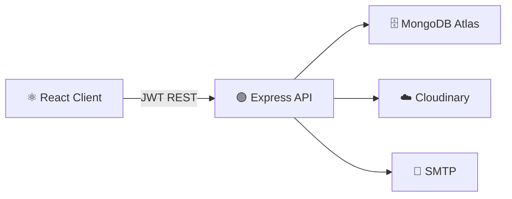

# DevHunt SRM

> **Product Hunt for Campus Developers** — Ship your projects, get peer reviews, earn XP, and climb the campus leaderboard. Built on the MERN stack.

[](https://opensource.org/licenses/MIT)
[](https://nodejs.org/)
[](https://react.dev/)

---

## What is DevHunt SRM?

A campus-exclusive developer platform built for **SRM Institute of Science and Technology** students. Think Product Hunt, but for your hostel neighbour''s side project.

- 🚀 **Ship projects** — submit your MVP with screenshots, tech stack, GitHub & live links
- ⭐ **Get peer reviews** — structured feedback across UI, code quality, innovation & more
- ⬆️ **Earn upvotes** — community driven discovery
- 🎮 **Level up** — XP system with badge achievements and a campus leaderboard

---

## Tech Stack

| Layer | Technology |
|-------|-----------|
| **Frontend** | React 18, Vite, React Router v6, Axios |
| **Backend** | Node.js, Express.js, JWT Auth |
| **Database** | MongoDB Atlas, Mongoose |
| **File Storage** | Cloudinary |
| **Email** | Nodemailer (SMTP) |
| **Styling** | Vanilla CSS, dark mode |

---

## Getting Started

### Prerequisites

- Node.js 18+ and npm
- MongoDB Atlas (free tier works)
- Cloudinary account (free tier)
- SMTP provider (Mailtrap for dev, SendGrid/Resend for prod)

### Setup

```bash
# 1. Clone
git clone https://github.com/Vineet2511/devhunt-srm.git
cd devhunt-srm

# 2. Install dependencies
cd server && npm install
cd ../client && npm install

# 3. Configure environment
cp server/.env.example server/.env   # fill in your credentials
# create client/.env with: VITE_API_URL=http://localhost:5000/api

# 4. Run
cd server && npm run dev   # Terminal 1 — http://localhost:5000
cd client && npm run dev   # Terminal 2 — http://localhost:5173
```

See [`server/.env.example`](./server/.env.example) for all required environment variables.

---

## Project Structure

```
devhunt-srm/
├── client/          # React + Vite frontend
│   └── src/
│       ├── components/
│       ├── contexts/
│       ├── pages/
│       ├── services/
│       ├── styles/
│       └── utils/
│
└── server/          # Node.js + Express backend
    ├── controllers/
    ├── middleware/
    ├── models/
    ├── routes/
    ├── services/    # Gamification, email, notifications
    ├── validators/
    └── seeds/
```

---

## Architecture



---

## XP & Levels

| Action | XP |
|--------|----|
| Ship a project | +10 |
| Write a review | +5 |
| Receive a review | +25 |
| Receive an upvote | +2 |

| Level | Title | XP |
|-------|-------|----|
| 1 | Novice Builder | 0+ |
| 2 | Campus Dev | 500+ |
| 3 | Code Ninja | 1,500+ |
| 4 | Ship Master | 3,000+ |
| 5 | Campus Legend | 5,000+ |

---

## Contributing

1. Fork → `git checkout -b feat/your-feature`
2. Commit → `git commit -m "feat: ..."`
3. Push → open a Pull Request

---

## License

MIT © DevHunt SRM
