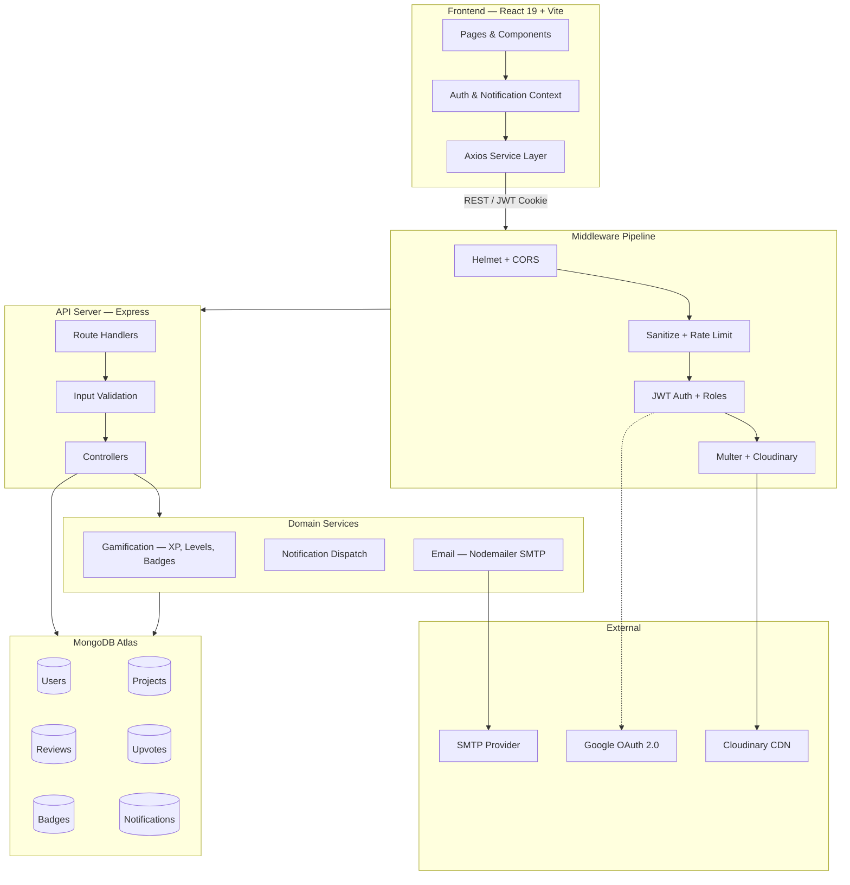
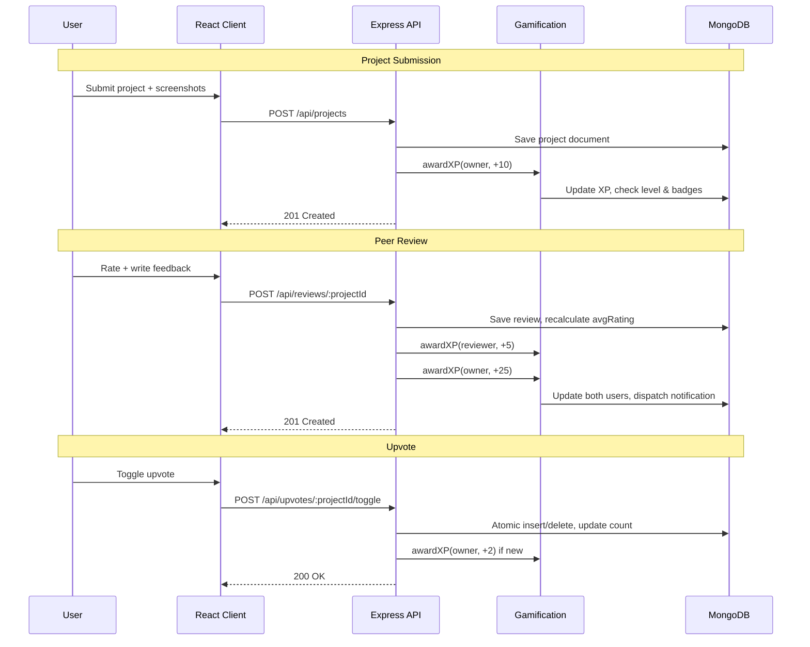
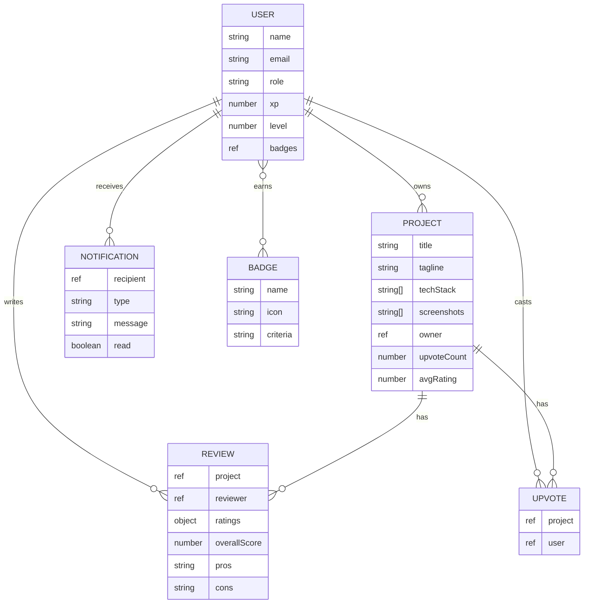

<div align="center">

# DevHunt SRM

**Product Hunt for Campus Developers**

Ship your side projects. Get structured peer reviews. Earn XP and climb the leaderboard.

Built for students at [SRM Institute of Science and Technology](https://www.srmist.edu.in/)

[](LICENSE)
[](https://nodejs.org)
[](https://react.dev)
[](https://mongodb.com)

</div>

---

## What is DevHunt SRM?

Students build incredible side projects that never get seen. DevHunt SRM gives them a stage.

**Project owners** submit their work with screenshots, tech stacks, and live links. **Reviewers** browse, upvote, and leave structured multi-axis feedback. Every action earns XP — ship enough and you go from *Novice Builder* to *Campus Legend* on the semester leaderboard.

**Core capabilities:**

- Submit projects with up to 5 Cloudinary-hosted screenshots
- Structured reviews across UI/UX, Code Quality, and Innovation
- One-click upvoting with animated counters
- XP engine with non-linear leveling and automated badge unlocks
- In-app notification feed for reviews, upvotes, level-ups, and badges
- JWT + Google OAuth authentication with SMTP password reset
- Full admin panel — user management, moderation, platform analytics

---

## Tech Stack

**Frontend** — React 19 · Vite 8 · React Router 7 · Axios · Vanilla CSS (dark-first glassmorphic theme)

**Backend** — Node.js 20 · Express 4 · Mongoose 8 · JWT · Bcrypt · Multer · Nodemailer

**Infrastructure** — MongoDB Atlas · Cloudinary CDN · Google Identity Services · SMTP (Mailtrap / SendGrid)

**Security** — Helmet · CORS whitelist · NoSQL injection sanitization · Rate limiting · httpOnly secure cookies

---

## Architecture

### System Overview



### Request Flow



### Data Model



---

## Project Structure

```
devhunt-srm/
│
├── client/                        Frontend (React + Vite)
│   └── src/
│       ├── components/            Navbar, ProjectCard, ReviewForm, StarRating, Skeleton, etc.
│       ├── contexts/              AuthContext, NotificationContext
│       ├── pages/                 Home, Explore, ProjectDetail, Dashboard, Leaderboard,
│       │                          Login, Register, Profile, SubmitProject, AdminDashboard
│       ├── services/              Axios API client
│       ├── styles/                Per-page CSS modules
│       └── utils/                 Formatters and helpers
│
├── server/                        Backend (Node + Express)
│   ├── config/                    DB connection, environment loader
│   ├── controllers/               auth, project, review, upvote, user, notification, admin
│   ├── middleware/                 auth, errorHandler, rateLimiter, sanitize, upload, validate
│   ├── models/                    User, Project, Review, Upvote, Badge, Notification
│   ├── routes/                    Express route definitions
│   ├── services/                  gamification, email, notification
│   ├── validators/                express-validator schemas
│   ├── seeds/                     seed.js (badges, mock users, test projects)
│   └── server.js                  Entry point
│
├── DESIGN.md                      UI design system spec
└── DEVLOG.md                      Development changelog
```

---

## Setup

### Prerequisites

- **Node.js** 20+ and npm
- **MongoDB** — Atlas (free tier) or local instance
- **Cloudinary** — free account for image uploads
- **SMTP** — Mailtrap (dev) or SendGrid / Resend (prod)

### Installation

```bash
# Clone the repository
git clone https://github.com/Vineet2511/devhunt-srm.git
cd devhunt-srm

# Install server dependencies
cd server
npm install
cp .env.example .env          # configure your credentials

# Install client dependencies
cd ../client
npm install
cp .env.example .env          # set VITE_API_URL
```

### Seed the database (optional)

```bash
cd server
node seeds/seed.js            # creates badges, mock users, sample projects
```

### Run

```bash
# Terminal 1 — API server
cd server && npm run dev      # → http://localhost:5000

# Terminal 2 — Dev client
cd client && npm run dev      # → http://localhost:5173
```

---

## Environment Variables

### `server/.env`

| Variable | Description |
|----------|-------------|
| `PORT` | Server port (default `5000`) |
| `NODE_ENV` | `development` or `production` |
| `MONGO_URI` | MongoDB connection string |
| `JWT_SECRET` | Secret for signing tokens |
| `JWT_EXPIRE` | Token lifetime (e.g. `7d`) |
| `COOKIE_EXPIRE` | Cookie lifetime in days |
| `CLIENT_URL` | Frontend origin for CORS |
| `CLOUDINARY_CLOUD_NAME` | Cloudinary cloud name |
| `CLOUDINARY_API_KEY` | Cloudinary API key |
| `CLOUDINARY_API_SECRET` | Cloudinary API secret |
| `SMTP_HOST` | SMTP server hostname |
| `SMTP_PORT` | SMTP port (`2525` for Mailtrap) |
| `SMTP_EMAIL` | SMTP auth username |
| `SMTP_PASSWORD` | SMTP auth password |
| `FROM_EMAIL` | Sender email address |
| `FROM_NAME` | Sender display name |

### `client/.env`

| Variable | Description |
|----------|-------------|
| `VITE_API_URL` | Backend API base URL |
| `VITE_GOOGLE_CLIENT_ID` | Google OAuth client ID |

---

## API Endpoints

### Authentication — `/api/auth`

| Method | Route | Auth | Description |
|--------|-------|------|-------------|
| POST | `/register` | — | Create account |
| POST | `/login` | — | Sign in (sets httpOnly cookie) |
| POST | `/google` | — | Google OAuth sign-in |
| POST | `/forgot-password` | — | Send reset email |
| POST | `/reset-password/:token` | — | Reset password |
| POST | `/logout` | ✓ | Clear session |
| GET | `/me` | ✓ | Current user profile |

### Projects — `/api/projects`

| Method | Route | Auth | Description |
|--------|-------|------|-------------|
| GET | `/` | — | List with search, sort, filter, pagination |
| GET | `/:id` | — | Single project with owner & reviews |
| POST | `/` | ✓ | Create (multipart, up to 5 screenshots) |
| PUT | `/:id` | Owner | Update |
| DELETE | `/:id` | Owner/Admin | Delete (cascades reviews & upvotes) |

### Reviews — `/api/reviews`

| Method | Route | Auth | Description |
|--------|-------|------|-------------|
| GET | `/project/:projectId` | — | List reviews for a project |
| POST | `/:projectId` | ✓ | Submit structured review |
| PUT | `/:id` | Author | Edit review |
| DELETE | `/:id` | Author/Admin | Delete review |

### Upvotes — `/api/upvotes`

| Method | Route | Auth | Description |
|--------|-------|------|-------------|
| POST | `/:projectId/toggle` | ✓ | Toggle upvote |

### Users — `/api/users`

| Method | Route | Auth | Description |
|--------|-------|------|-------------|
| GET | `/leaderboard` | — | XP rankings |
| GET | `/:id` | — | Public profile |
| PUT | `/profile` | ✓ | Update own profile |

### Notifications — `/api/notifications`

| Method | Route | Auth | Description |
|--------|-------|------|-------------|
| GET | `/` | ✓ | All notifications |
| GET | `/unread-count` | ✓ | Unread count |
| PUT | `/:id/read` | ✓ | Mark one read |
| PUT | `/read-all` | ✓ | Mark all read |

### Admin — `/api/admin`

| Method | Route | Auth | Description |
|--------|-------|------|-------------|
| GET | `/stats` | Admin | Platform analytics |
| GET | `/users` | Admin | User list (search, filter) |
| PATCH | `/users/:id/role` | Admin | Change role |
| DELETE | `/users/:id` | Admin | Delete user (cascade) |
| DELETE | `/projects/:id` | Admin | Remove project |
| DELETE | `/reviews/:id` | Admin | Remove review |

---

## Gamification

Every meaningful action on DevHunt earns XP:

| Action | XP | Recipient |
|--------|----|-----------|
| Submit a project | +10 | Creator |
| Write a review | +5 | Reviewer |
| Receive a review | +25 | Project owner |
| Receive an upvote | +2 | Project owner |

### Leveling

Progression follows `Level = floor(sqrt(XP / 10)) + 1`:

| Level | Title | XP Required |
|-------|-------|-------------|
| 1 | Novice Builder | 0 |
| 2 | Campus Dev | 10 |
| 3 | Code Ninja | 40 |
| 4 | Ship Master | 90 |
| 5 | Campus Legend | 160 |

### Badges

| Badge | Unlocked when |
|-------|--------------|
| 🚀 First Project | You ship your first project |
| 🕵️ First Review | You write your first review |
| ⬆️ First Upvote | You upvote a project |
| 💯 Centurion | You hit 100 XP |
| 🌟 Veteran | You hit 500 XP |

---

## Contributing

1. Fork the repo
2. `git checkout -b feat/your-feature`
3. `git commit -m "feat: add your feature"`
4. Push and open a Pull Request


