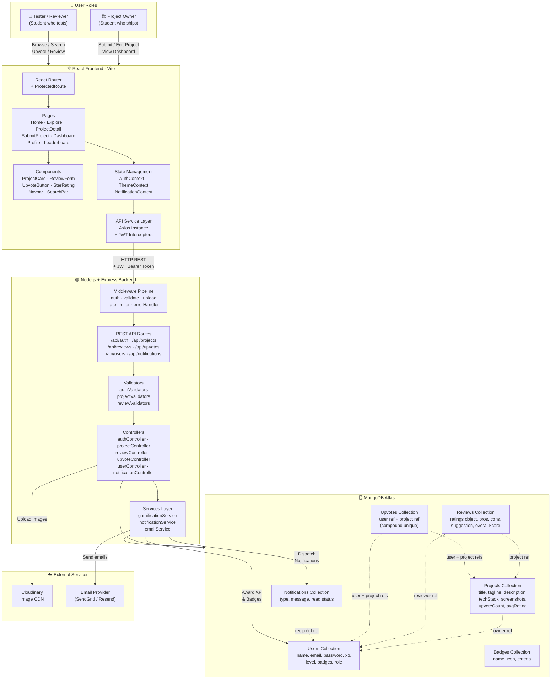
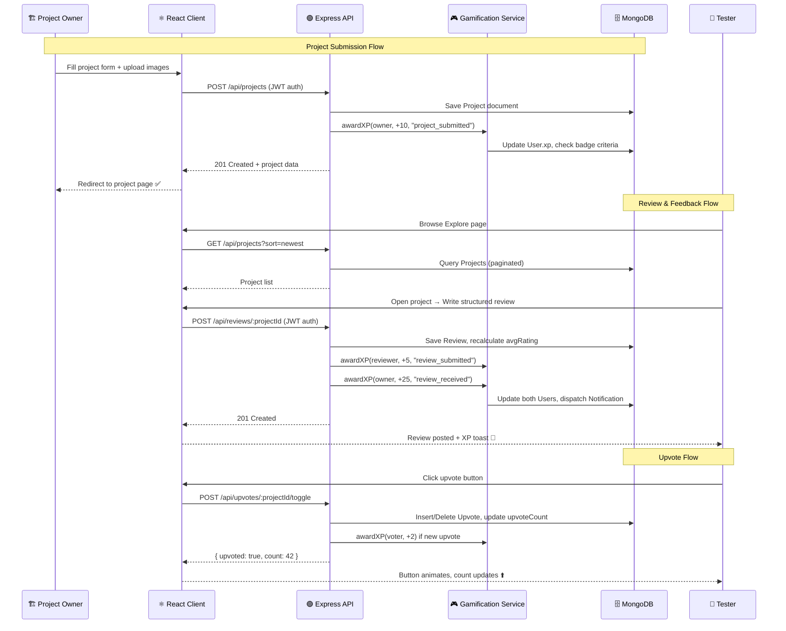

# DevHunt SRM

> **Product Hunt for Campus Developers** — A platform where students list their projects, and peers test them, leave structured feedback, and collaborate. Built on the MERN stack.

---

## System Architecture



---

## Data Flow Summary



---

## Tech Stack

| Layer | Technology |
|-------|-----------|
| **Frontend** | React 18, Vite, React Router, Axios |
| **Backend** | Node.js, Express.js, JWT Auth |
| **Database** | MongoDB Atlas, Mongoose ODM |
| **File Storage** | Cloudinary |
| **Styling** | Vanilla CSS (custom properties + dark mode) |

---

## Getting Started

```bash
# Clone the repo
git clone https://github.com/<your-username>/devhunt-srm.git
cd devhunt-srm

# Install dependencies
cd server && npm install
cd ../client && npm install

# Set up environment variables
cp server/.env.example server/.env
cp client/.env.example client/.env

# Run both dev servers
npm run dev
```
